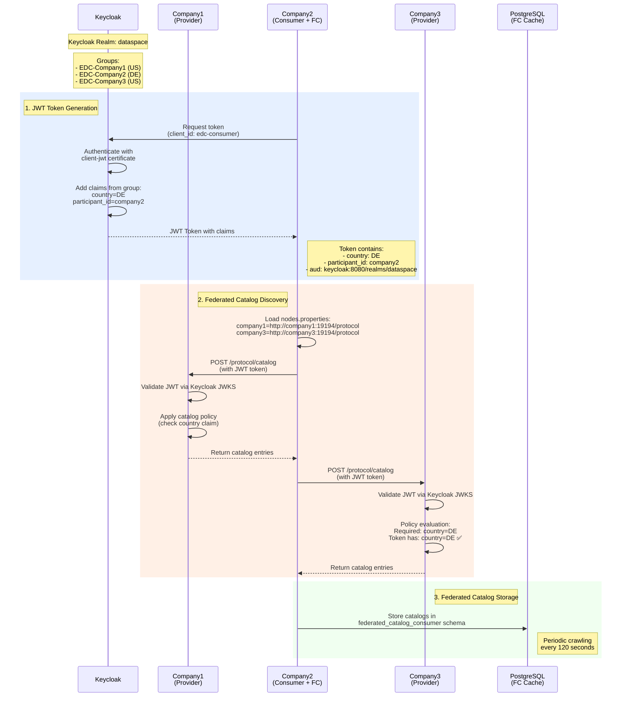
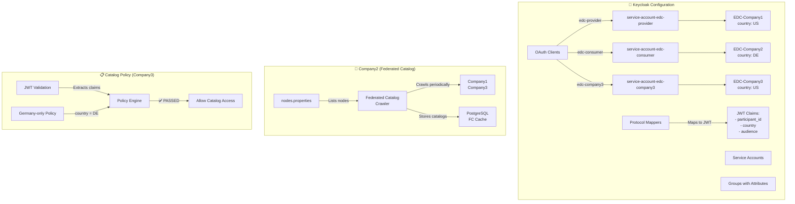
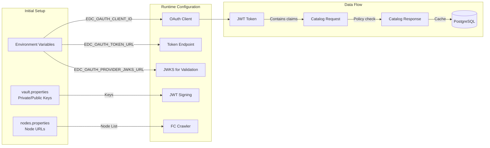

# EDC Authentication & Federated Catalog Flow

## Architecture Diagram



## Component Details



## Configuration Flow



## Key Configuration Points

### 1. **Keycloak Setup**
- Each EDC connector has its own OAuth client
- Service accounts linked to groups with country attributes
- JWT tokens include participant_id and country claims

### 2. **Federated Catalog (Company2)**
```yaml
EDC_CATALOG_CACHE_ENABLED: true
EDC_CATALOG_CACHE_EXECUTION_PERIOD_SECONDS: 120
EDC_NODES_FILE_PATH: /resources/nodes.properties
```

### 3. **Policy Evaluation (Company3)**
- Checks country claim in JWT token
- Required: country = DE
- Token has: country = DE (from Company2's group)
- Result: ✅ POLICY CHECK PASSED

### 4. **Database Schemas**
- `provider` - Company1 data
- `consumer` - Company2 data  
- `company3` - Company3 data
- `federated_catalog_consumer` - FC cache for Company2

## Authentication Flow Summary

1. **Token Request**: Company2 requests JWT from Keycloak using client credentials
2. **Token Generation**: Keycloak generates JWT with claims from group attributes
3. **Catalog Request**: Company2 uses JWT to request catalogs from other nodes
4. **Policy Validation**: Target nodes validate JWT and apply policies
5. **Catalog Response**: If policies pass, catalog data is returned
6. **Cache Storage**: Company2 stores catalogs in PostgreSQL for federated access